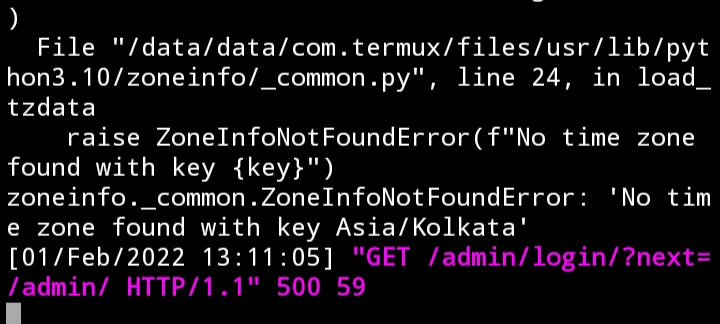
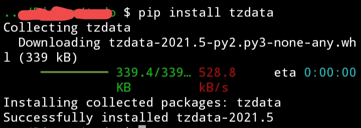
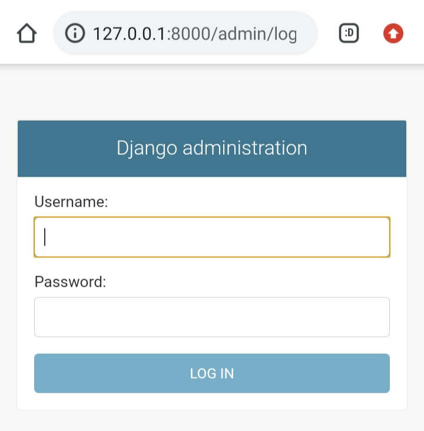

# Django_TimeZone_solution

# settings.py
- TIME_ZONE = 'Asia/Colombo'
- USE_I18N = True
- USE_L10N = True
- USE_TZ = True
# Check module tzdata is installed or not
- for installing 
<code> pip install tzdata </code>

# Error fixed

